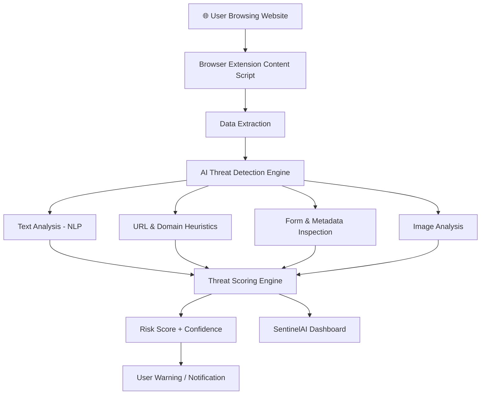

<div align="center">

# 🛡️ SentinelAI

### AI-Powered Social Engineering & Phishing Detection Platform

**A multi-modal AI security system and browser extension that detects phishing, spam, and social engineering attacks in real time.**
*Combining NLP, heuristic intelligence, adaptive learning, and threat visualization to protect users across the web.*

<br>

[](https://react.dev/)
[](https://www.typescriptlang.org/)
[](https://vitejs.dev/)
[](https://developer.chrome.com/docs/extensions/)
[](https://tailwindcss.com/)
[]()

</div>

---

# 📖 What is SentinelAI?

SentinelAI is an **AI-powered cybersecurity platform and browser extension** built to combat modern **phishing, spam, and social engineering attacks**.

As attackers increasingly leverage **AI-generated scams**, traditional spam filters struggle to keep up. SentinelAI addresses this challenge by combining **natural language analysis, URL heuristics, behavioral signals, and adaptive learning** to identify malicious activity before it harms the user.

When a user visits a webpage or receives suspicious content:

1. The **browser extension analyzes page content, links, and forms**.
2. The **AI threat engine evaluates phishing patterns, spoofed domains, and suspicious language**.
3. A **risk score with confidence metrics** is generated.
4. The system provides **real-time warnings and educational feedback**.
5. Insights can be visualized in the **SentinelAI dashboard website**.

This hybrid system combines **browser-level protection with centralized analytics dashboards**, making it suitable for both **individual users and enterprise security teams**.

---

# ✨ Features

| Feature                                | Description                                                            |
| -------------------------------------- | ---------------------------------------------------------------------- |
| 🧠 **AI-Driven Threat Detection**      | NLP analysis of phishing phrases, urgency cues, and authority patterns |
| 🔗 **URL & Domain Spoof Detection**    | Detects suspicious TLDs, IP-based URLs, and spoofed domains            |
| 🖼 **Image Spoof Detection (Planned)** | Detect fake logos and deceptive images                                 |
| 📊 **Risk Scoring Engine**             | Calculates threat scores with confidence metrics                       |
| 🧬 **Federated Learning Simulation**   | Adaptive threat detection using anonymized insights                    |
| 🎯 **Predictive GAN Simulations**      | Generates synthetic phishing attacks for defense testing               |
| 📉 **Security Dashboards**             | Visualize threats and detection insights                               |
| 🎓 **User Awareness Training**         | Gamified modules to educate users about phishing                       |
| 🏢 **Enterprise Integrations**         | APIs, compliance reporting, and policy enforcement                     |

---

# 🏗️ System Architecture

### Security Detection Pipeline



---

### Platform Architecture

SentinelAI consists of **three major components**:

#### 1️⃣ Browser Extension (Core Security Layer)

* Content scripts monitor web page content.
* Background service worker processes detection requests.
* Local AI engine evaluates phishing threats.
* Chrome APIs handle notifications and browser interaction.

#### 2️⃣ SentinelAI Website

Provides:

* Security dashboards
* Threat analytics
* Documentation
* Enterprise integration modules

#### 3️⃣ AI Threat Engine

Responsible for:

* NLP phishing detection
* Domain spoofing detection
* Suspicious form analysis
* Risk scoring and confidence calculation

---

# 🛠️ Technology Stack

### 🌐 Website (Frontend)

| Component     | Technology     |
| ------------- | -------------- |
| Framework     | `React`        |
| Language      | `TypeScript`   |
| Build Tool    | `Vite`         |
| UI Components | `shadcn-ui`    |
| Styling       | `Tailwind CSS` |

---

### 🧩 Browser Extension

| Component               | Technology                                     |
| ----------------------- | ---------------------------------------------- |
| Extension Framework     | `Chrome Manifest V3`                           |
| Language                | `JavaScript (ES6+)`                            |
| Browser APIs            | `Chrome Tabs, Runtime, Storage, Notifications` |
| Threat Detection Engine | Custom heuristic NLP logic                     |
| Data Storage            | JSON threat patterns                           |
| Future Integration      | `TensorFlow.js` for image analysis             |

---

# 📂 Project Structure

```text
SentinelAI/
│
├── extension/                    # Chrome Extension (Manifest V3)
│
│   ├── background/
│   │   └── service-worker.js     # Background script for detection logic
│
│   ├── content/
│   │   └── content.js            # Injected scripts analyzing page content
│
│   ├── popup/
│   │   ├── popup.html
│   │   ├── popup.css
│   │   └── popup.js              # Popup interface logic
│
│   ├── lib/
│   │   ├── ai-engine.js          # AI threat detection engine
│   │   └── utils.js              # Utility helpers
│
│   ├── assets/
│   │   ├── icons/
│   │   └── models/
│   │       ├── threat-patterns.json
│   │       ├── logo-database.json
│   │       └── blacklist.json
│
│   ├── styles/
│   │   └── content.css
│
│
├── website/                      # React + Vite dashboard
│   ├── src/
│   ├── components/
│   ├── pages/
│   ├── public/
│   └── tailwind.config.js
│
└── README.md
```

---

# 🚀 Installation & Setup

## Prerequisites

* Node.js 18+
* Chrome Browser
* npm or yarn

---

# 1️⃣ Clone the Repository

```bash
git clone https://github.com/kishorekrrish3/SentinelAI-Phishing-and-Social-Engineering-Detection-Engine-and-Extension.git
cd SentinelAI-Phishing-and-Social-Engineering-Detection-Engine-and-Extension
```

---

# 2️⃣ Install Dependencies

```bash
npm install
```

---

# 3️⃣ Run the Website

```bash
npm run dev
```

The dashboard will be available at:

```
http://localhost:5173
```

---

# 🔌 Installing the Browser Extension

1. Open Chrome and navigate to:

```
chrome://extensions/
```

2. Enable **Developer Mode**.

3. Click **Load unpacked**.

4. Select the `extension/` folder.

The SentinelAI extension will now be active.

---

# 🌐 Usage

Once installed:

1️⃣ Browse any website normally.

2️⃣ SentinelAI analyzes:

* page content
* links
* forms
* domain metadata

3️⃣ If a threat is detected, the extension provides:

* ⚠️ Warning alerts
* 📊 Risk score
* 📋 Threat breakdown

4️⃣ View analytics in the **SentinelAI Dashboard**.

---

# ⚙️ Configuration

| Setting           | File                   | Description                |
| ----------------- | ---------------------- | -------------------------- |
| Threat Patterns   | `threat-patterns.json` | NLP phishing indicators    |
| Domain Blacklist  | `blacklist.json`       | Known malicious domains    |
| Logo Detection DB | `logo-database.json`   | Brand logo spoof detection |
| AI Engine Logic   | `ai-engine.js`         | Risk scoring and detection |

---

# 🐛 Known Issues & Troubleshooting

### Extension not detecting threats

Ensure:

* The extension is enabled in **chrome://extensions**
* The page allows content scripts to run

---

### Dashboard not loading

Verify the Vite server started successfully:

```
http://localhost:5173
```

Restart the development server if needed.

---

# 🔮 Future Improvements

* 🧠 **Deep learning phishing detection models**
* 🖼 **TensorFlow.js image spoof detection**
* 🔗 **Real-time threat intelligence feeds**
* 📊 **Enterprise SOC dashboards**
* 🛡 **Cross-browser extension support**
* 🔍 **Large-scale phishing dataset training**

---

# 🤝 Contributing

We welcome contributions from the community.

1. Fork the repository
2. Create a feature branch
3. Commit your changes
4. Open a pull request

Please follow project coding guidelines and check existing issues before submitting.

---

# 📜 License

This project is licensed under the **MIT License**.

---

<div align="center">

<br>

<i>Defending the internet from AI-powered scams with AI itself.</i>

<br><br>

<b>SentinelAI</b> — intelligent security for the modern web.

</div>
